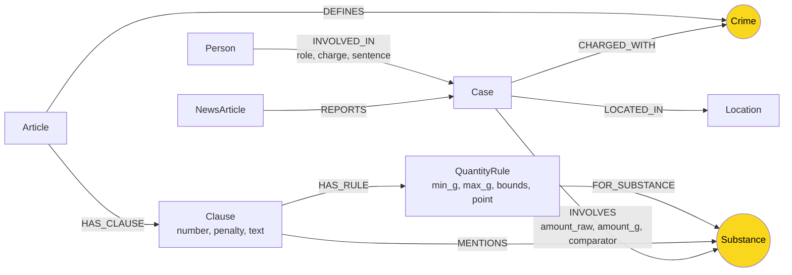

# Thiết kế Ontology — Day 19

**Họ tên:** Nguyễn Anh Tuấn  **MSSV:** 2A202602700

**Lựa chọn** (đánh dấu một):
- [ ] Dùng ontology gợi ý (có thể chỉnh nhỏ)
- [x] Tự thiết kế (xét bonus +15, xem `SUBMISSION.md`)

KG-2, KG-3 và KG-4 đã được triển khai trong `src/graph.py`. Benchmark đầy đủ cho 18 văn bản luật và 20 bài báo nằm trong [ket_qua_benchmark_kg.txt](../ket_qua_benchmark_kg.txt): 343 node / 601 cạnh ở lần chạy đó. Số liệu graph 2 bài ở mục 7 chỉ là kiểm tra cục bộ trước benchmark.

## 1. Sơ đồ

`Crime` nối KB tin tức với KB luật; `Substance` giúp tìm các vụ liên quan cùng chất và đối chiếu ngưỡng khối lượng.

Khác biệt chính so với gợi ý: `QuantityRule` lưu ngưỡng có thể so sánh; `Case` và `Person` không dùng tên tự do làm khóa. Mức án đã tuyên thuộc người trong vụ (`INVOLVED_IN.sentence`); khung hình phạt của luật thuộc `Clause.penalty`.

## 2. Entity types (node labels)

| Label | Ý nghĩa | Khóa định danh (`MERGE` theo) | Properties | Lấy từ KB nào | Trích bằng |
| --- | --- | --- | --- | --- | --- |
| `Article` | Một điều luật | `id` = metadata `article`, ví dụ `Điều 250 BLHS` | `title`, `law`, `doc_id` | Luật | Metadata và regex |
| `Clause` | Một khoản của điều luật | `id` = `Article.id + " khoản " + number` | `number`, `penalty`, `text`, `doc_id` | Luật | Regex tách khoản, giữ nguyên văn |
| `QuantityRule` | Điều kiện khối lượng của một chất tại một điểm/khoản | `id` = `Clause.id + " điểm " + point + " " + substance` | `point`, `min_g`, `max_g`, `min_inclusive`, `max_inclusive`, `raw_text`, `doc_id` | Luật | Regex cho mẫu xác định; không chắc thì không tạo rule |
| `Crime` | Tội danh chuẩn dùng chung | `name` chuẩn hóa | `name`, `source_doc_ids` | Cả hai | Tiêu đề điều luật; tin trích bằng LLM rồi `link_entity` |
| `NewsArticle` | Nguồn của một bài báo, kể cả khi không có vụ án | `id` = `doc_id` | `title`, `source_url`, `doc_id` | Tin | Metadata |
| `Case` | Một vụ việc được bài báo kể | `id` = `doc_id + ":case:" + case_index` | `name`, `summary`, `date`, `source_title`, `doc_id` | Tin | LLM; `case_index` là thứ tự trong bài |
| `Person` | Người được nhắc trong một bài | `id` = `doc_id + ":person:" + normalized_name` | `name`, `aliases`, `doc_id` | Tin | LLM, chuẩn hóa tên trong phạm vi bài |
| `Substance` | Tên chất ma túy chuẩn | `name`, ví dụ `MDMA` | `name`, `source_doc_ids` | Cả hai | Danh sách chất/regex ở luật; LLM và chuẩn hóa bí danh trong Python ở tin |
| `Location` | Địa điểm của vụ trong bài | `id` = `doc_id + ":location:" + normalized_name` | `name`, `doc_id` | Tin | LLM |

`doc_id` có trên các node gắn với đúng một tài liệu: `Article`, `Clause`, `QuantityRule`, `NewsArticle`, `Case`, `Person`, `Location`. `Crime` và `Substance` là node chuẩn dùng chung, nên lưu nguồn ở `source_doc_ids` thay vì gán một `doc_id` đơn lẻ gây hiểu nhầm. Mỗi tài liệu luật/tin vẫn có node riêng mang `doc_id` để vector search tìm được điểm vào graph.

Không tự động gộp `Person` hoặc `Case` giữa các bài chỉ vì tên giống nhau: có thể là hai người hoặc hai vụ khác nhau. Đổi lại, cùng người/vụ xuất hiện ở nhiều bài có thể có nhiều node; chỉ hợp nhất khi có bằng chứng định danh đủ mạnh.

## 3. Relationships

| Type | Từ → Đến | Properties trên cạnh | Ý nghĩa |
| --- | --- | --- | --- |
| `DEFINES` | `Article` → `Crime` | Không | Điều luật quy định tội danh |
| `REPORTS` | `NewsArticle` → `Case` | Không | Bài báo kể về vụ việc |
| `HAS_CLAUSE` | `Article` → `Clause` | Không | Điều luật gồm các khoản |
| `MENTIONS` | `Clause` → `Substance` | Không | Khoản nhắc tới chất; chưa khẳng định một ngưỡng áp dụng |
| `HAS_RULE` | `Clause` → `QuantityRule` | Không | Khoản có điều kiện khối lượng đã phân tích được |
| `FOR_SUBSTANCE` | `QuantityRule` → `Substance` | Không | Điều kiện khối lượng áp cho chất nào |
| `CHARGED_WITH` | `Case` → `Crime` | Không | Tội danh được nêu trong tin về vụ |
| `INVOLVES` | `Case` → `Substance` | `amount_raw`, `amount_g`, `comparator` (`=`, `>`, `>=`, `~` hoặc rỗng) | Vụ liên quan đến chất; `amount_g` được đổi sang gam, `amount_raw` giữ câu chữ bài báo |
| `LOCATED_IN` | `Case` → `Location` | Không | Nơi diễn ra vụ theo tin |
| `INVOLVED_IN` | `Person` → `Case` | `role`, `charge`, `sentence` | Vai trò, tội danh và mức án của **người đó** trong vụ |

Chỉ tạo `QuantityRule` khi xác định được chất, đơn vị và cận khoảng. Ví dụ: Điều 250 BLHS khoản 4 điểm b quy định MDMA **100 gam trở lên** → `min_g=100`, `min_inclusive=true`, `max_g=null`. Tin về Cái Quang Huy ghi **hơn 9,6 kg MDMA** → `amount_g=9600`, `comparator=">"`; lượng thực lớn hơn 9600 g, nên vượt ngưỡng 100 g. Điều kiện về tổng lượng nhiều chất hoặc khối lượng tương đương chưa được suy diễn từ một rule đơn chất.

## 4. Node cầu nối giữa 2 KB

- **Node nào:** `Crime` là cầu nối chính: `Case → CHARGED_WITH → Crime ← DEFINES ← Article`. `Substance` là cầu nối bổ sung: `Case → INVOLVES → Substance ← FOR_SUBSTANCE ← QuantityRule ← HAS_RULE ← Clause`.
- **Vì sao chọn:** Q3–Q4 cần từ vụ/người tìm điều luật của tội danh; Q5 cần thêm chất và khối lượng; Q6 cần liệt kê các vụ cùng liên quan MDMA.
- **Cách khớp tên:** Lấy danh sách tội chuẩn từ tiêu đề điều luật. Chuẩn hóa khoảng trắng, chữ hoa/thường, tiền tố “Tội”, biến thể dấu/chính tả, rồi dùng `link_entity`; không nối khi dưới ngưỡng tin cậy. Với chất, dùng tên chuẩn và bảng bí danh có kiểm soát, giữ tên gốc trong nguồn.
- **Khi cầu gãy:** Tin ghi tội danh khác tên chuẩn, không nêu tội, hoặc LLM trích sai; chất viết bằng tên đồng nghĩa chưa có trong bảng. Giữ tên gốc để kiểm tra, chỉ bổ sung ánh xạ khi xác nhận được và dùng chunk gốc khi không nối được. Không ép nối với tên gần giống nhưng chưa chắc đúng.
- **Nguồn gốc:** Node toàn cục có `source_doc_ids`; node theo tài liệu có `doc_id`. Câu trả lời cần dẫn về `Article`/`Clause` và `Case` mang `doc_id`, tránh lấy riêng một tên chuẩn làm bằng chứng.

## 5. Competency questions

| Câu | Đường đi (Cypher pattern hoặc phép tra) | Trả lời được? |
| --- | --- | --- |
| Q1 — định nghĩa tiền chất | `(:Article {id:'Điều 2 Luật PCMT'})-[:HAS_CLAUSE]->(:Clause {number:4})`; đọc `Clause.text` | Có, bằng nguyên văn khoản định nghĩa; không cần node tội danh |
| Q2 — ai bị tuyên tử hình trong vụ 36 kg | `(:Person)-[r:INVOLVED_IN]->(k:Case)`; tìm vụ theo `k.summary/source_title/date`, lọc `r.sentence` là “tử hình” | Có, nếu LLM trích đúng người và mức án riêng |
| Q3 — Lê Minh Thành, mức án, tội, Điều 251 và khung cơ bản | `(:Person {name:'Lê Minh Thành'})-[r:INVOLVED_IN]->(:Case)-[:CHARGED_WITH]->(:Crime)<-[:DEFINES]-(:Article)-[:HAS_CLAUSE]->(:Clause {number:1})`; lấy `r.sentence`, tên tội và `Clause.penalty` | Có |
| Q4 — Hoàng Nato bị bắt về hành vi gì, khung cao nhất | Tìm `Person.aliases` có “Hoàng Nato” → `Case → Crime ← Article → Clause`; đọc các `Clause.penalty`, lấy khung cao nhất và giữ ngữ cảnh “bị bắt” từ tin | Có về hành vi và khung luật; graph chưa phân biệt đầy đủ giai đoạn tố tụng |
| Q5 — Cái Quang Huy, MDMA, khoản tương ứng | `Person → Case → Crime ← Article → Clause → QuantityRule → Substance`, đồng thời `Case -[:INVOLVES {amount_g, comparator}]-> Substance`; chỉ so sánh khi cùng tội, cùng chất và số lượng đủ rõ | Có cho MDMA > 9,6 kg và ngưỡng ≥ 100 g ở khoản 4 Điều 250; phải đọc `raw_text` và tin gốc trước khi nói khoản “được áp dụng” về mặt pháp lý |
| Q6 — những vụ có MDMA | `(:Substance {name:'MDMA'})<-[:INVOLVES]-(k:Case)<-[:INVOLVED_IN]-(p:Person)`; `DISTINCT k.id`, trả `k.name`, `p.name`, nguồn bài | Có; khóa vụ theo `doc_id + case_index` tránh gộp nhầm hai vụ trùng tên |

Nếu graph thiếu dữ kiện do trích xuất, GraphRAG vẫn cần giữ chunk gốc của vector search trong prompt; không suy diễn dữ kiện không có trong graph hoặc nguồn.

### Truy xuất KG-3 đã triển khai

`Neo4jGraph.context()` lấy seed theo `doc_id` và tên trong câu hỏi, rồi ưu tiên vụ trong tài liệu đã truy xuất hoặc vụ gắn với người được nêu đích danh. Từ `Case`, truy vấn qua `Crime ← Article → Clause`; giữ khoản 1, khoản được hỏi trực tiếp và khoản có `QuantityRule` khớp khối lượng của vụ. Với “hơn X”, chỉ chọn rule có cận trên mở để không khẳng định sai khoảng; lượng “gần/khoảng” không tự quyết định khoản. Câu hỏi “cao nhất” lấy khoản có khung tù cao nhất trong đúng tội của người được hỏi. Câu hỏi trực tiếp về Điều luật và kết quả vector từ luật cũng lấy nội dung khoản liên quan, kể cả định nghĩa “tiền chất”. Các dữ kiện trùng được gộp và giới hạn bởi `max_facts`.

Lần `--check` gần nhất chạy trên database riêng cho bonus, có đủ 7 dòng `[OK]`, gồm KG-2: 255 node / 506 cạnh, KG-3: 10 dữ kiện có Điều 251 và KG-4. Output nguyên văn ở [bonus_check.txt](bonus_check.txt). KG-4 giữ nguyên top-k chunk của Flat RAG, lấy `doc_id` không trùng để mở rộng graph, rồi gửi cả hai loại ngữ cảnh cho LLM. Benchmark đầy đủ đã kiểm tra Q1–Q6; kết quả Q6 đạt recall 0.33 và judge 2, được phân tích trong [REPORT_KG.md](REPORT_KG.md).

## 6. Quyết định thiết kế và đánh đổi

1. **Thêm `QuantityRule` cho điều kiện khối lượng có cấu trúc.** Phương án khác là chỉ giữ `Clause.text`. Node mới cho phép đối chiếu MDMA của Q5 theo gam; đổi lại phải viết parser, xử lý cận khoảng và tránh áp dụng sai khi luật quy định nhiều chất cùng lúc. Giữ `raw_text` để kiểm tra.
2. **Khóa `Case`/`Person` theo tài liệu thay vì tên do LLM đặt.** Phương án khác là `MERGE` theo `name`. Khóa theo tài liệu tránh gộp nhầm vụ/người cùng tên; đổi lại cùng một vụ xuất hiện ở nhiều bài có thể chưa gộp.
3. **Giữ `Crime` và `Substance` là node chuẩn dùng chung.** Phương án khác là một node riêng cho mỗi lần nhắc trong từng tài liệu. Node chung rút ngắn đường đi xuyên KB và hỗ trợ Q6; đổi lại cần chuẩn hóa và có nguy cơ nối sai. Dùng `link_entity`, bảng tên chất chuẩn và từ chối khi không đủ chắc chắn.
4. **Giữ mức án đã tuyên trên `INVOLVED_IN`, khung luật trên `Clause`.** Phương án khác là đặt một mức án trên `Case` hoặc có node `Sentence` riêng. Với câu hỏi hiện tại, thuộc tính trên cạnh đủ cho Q2–Q3 và tránh gán án của người này cho người khác; chưa mô hình hóa nhiều bản án/phúc thẩm của cùng người.

## 7. So với ontology gợi ý (bắt buộc nếu xét bonus)

| Điểm khác | Gợi ý làm gì | Thiết kế này làm gì | Vấn đề giải quyết | Bằng chứng đã chạy |
| --- | --- | --- | --- | --- |
| Ngưỡng khối lượng | `Clause.text` và `MENTIONS` lưu nguyên văn nhưng không có cận số | Thêm `QuantityRule` với `min_g/max_g`, cờ bao gồm cận, `FOR_SUBSTANCE`; lượng tin có `amount_g/comparator` | So hơn 9,6 kg MDMA với mốc 100 g ở khoản 4 Điều 250 | CQ-B1 chạy cùng Cypher số học: HINT 0 hàng; mới 1 hàng, 9600 g với dấu >, ngưỡng 100 g, khoản 4 điểm b |
| Khóa vụ | `Case` theo tên LLM đặt | `Case.id = doc_id + ":case:" + case_index` | Tránh nhập hai vụ trùng tên thành một node và ghi đè nguồn | Fixture CQ-B2 dùng JSON cố định: HINT 1 Case sau khi nạp 2 nguồn; mới giữ 2 Case và 2 mức án |
| Khóa người | `Person` theo tên | `Person.id = doc_id + ":person:" + normalized_name`, `aliases` riêng | Tránh nhập hai người khác nhau nhưng trùng tên giữa các bài | Cùng fixture CQ-B2: HINT 1 Person, aliases người B; mới 2 Person, giữ aliases người A/B theo nguồn |

**Nguồn và cách chạy baseline:** [baselines/hint/README.md](../baselines/hint/README.md) ghi rõ các hàm HINT lấy từ commit `859e8d1`, KG-3 theo Bước 5 và lệnh chạy lại. [bonus_compare.py](../scripts/bonus_compare.py) dùng biến `LAB_SOLUTION_PACKAGE` có sẵn của benchmark; không sửa benchmark hoặc test gốc. Database bonus riêng ở cổng 17687; graph bài chính chỉ được đọc.

**So sánh benchmark GraphRAG** ([HINT](../ket_qua_benchmark_kg.hint.txt) / [tự thiết kế](../ket_qua_benchmark_kg.txt)):

| Chỉ số | HINT | Tự thiết kế |
| --- | ---: | ---: |
| Node / cạnh tại lần benchmark | 202 / 381 | 343 / 601 |
| Recall trung bình | 0.63 | 0.89 |
| Judge trung bình | 1.33 | 2.00 |
| Indexing USD | 0.00925 | 0.00992 |
| Token đầu vào mỗi câu | 3307 | 1468 |
| USD mỗi câu | 0.00053 | 0.00026 |

Trong lần chạy này, Q4 HINT trả “Không đủ thông tin” (recall 0 / judge 0), bản mới trả đúng hành vi và mức tối đa (1 / 2). Q5 HINT trả nhầm Điều 251 (0.80 / 1), bản mới nêu khoản 4 Điều 250 (1 / 2). Bằng chứng câu trả lời nguyên văn, Cypher và kết quả nằm trong [BONUS_EVIDENCE.md](BONUS_EVIDENCE.md); dữ liệu máy đọc được ở [bonus_evidence.json](bonus_evidence.json).

**Competency questions bổ sung:** CQ-B1 trên corpus thật đối chiếu số gam với ngưỡng điểm/khoản trực tiếp bằng graph; HINT còn thiếu cấu trúc số học. CQ-B2 trên dữ liệu tổng hợp hỏi mức án của hai người/vụ trùng tên theo từng nguồn A/B: HINT chỉ giữ nguồn B 7 năm, thiết kế mới giữ A 2 năm và B 7 năm. Fixture được đánh dấu tổng hợp và dùng cùng JSON cố định cho hai builder, không phải chứng cứ về hai vụ thật.

**Đánh đổi và giới hạn:** Graph mới lớn hơn và indexing đắt hơn; ngữ cảnh hỏi gọn hơn trong lần đo này. Khóa theo nguồn tránh gộp nhầm nhưng vẫn để lại trùng cùng người qua nhiều bài (E3). Hai benchmark trích xuất và sinh câu trả lời bằng LLM riêng nên chênh lệch điểm phản ánh cả prompt, truy xuất và ontology; một lần chạy chưa chứng minh tác động nhân quả của riêng từng thay đổi. Truy vấn số học và fixture cố định cung cấp bằng chứng trực tiếp cho hai khả năng cấu trúc mới.

## 8. Hạn chế còn lại

- Chỉ parse ngưỡng khối lượng đơn chất có cú pháp rõ; tổng lượng nhiều chất, thể tích hoặc chất tương đương vẫn phải đọc nguyên văn luật. So ngưỡng là gợi ý truy xuất, không tự kết luận khoản luật đã được cơ quan tố tụng áp dụng.
- Tin dùng “hơn”, “gần”, “khoảng” có độ chính xác khác nhau. Lưu `amount_raw` và `comparator`; nếu số lượng sát cận hoặc mơ hồ thì không chọn khoản tự động.
- Một bài có thể kể nhiều lần vận chuyển cùng một chất. Chỉ ghi tổng khối lượng lên `Case → INVOLVES` khi bài nêu rõ tổng hoặc các phần được xác nhận là không trùng; không cộng các con số một cách máy móc.
- Chưa mô hình hóa “bắt”, “khởi tố”, “truy tố”, “xét xử”, “phúc thẩm” thành sự kiện riêng; Q4 phải giữ câu chữ bài báo để không biến việc bị bắt thành việc đã bị tuyên án.
- Chưa gộp chắc chắn cùng người/cùng vụ giữa nhiều bài; alias chỉ giúp tìm kiếm trong một bài. Q6 có thể cần rà soát trùng vụ liên bài.
- LLM có thể bỏ sót hoặc gán nhầm tội, chất, vai trò hay mức án. Mọi liên kết quan trọng cần kiểm tra lại bằng `doc_id` và văn bản nguồn.
